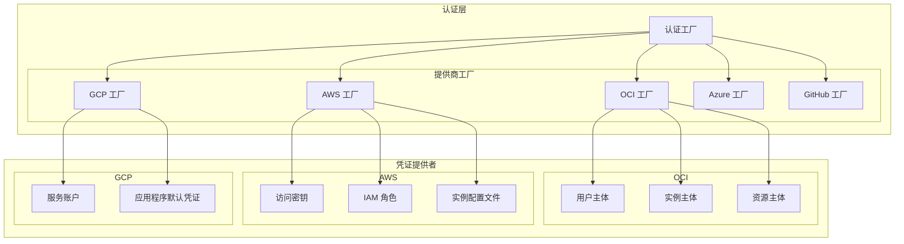
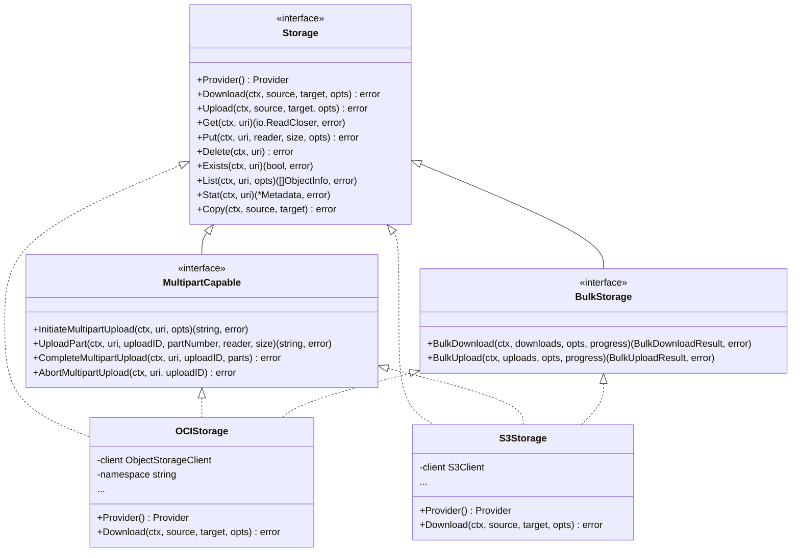

# OEP-0002: 多云存储和认证支持

<!-- toc -->
- [概述](#概述)
- [动机](#动机)
  - [目标](#目标)
  - [非目标](#非目标)
- [提案](#提案)
  - [用户故事](#用户故事)
  - [注意事项/约束/注意点](#注意事项约束注意点)
  - [风险和缓解措施](#风险和缓解措施)
- [设计细节](#设计细节)
  - [认证架构](#认证架构)
  - [存储架构](#存储架构)
  - [URI 规范](#uri-规范)
  - [提供商实现](#提供商实现)
  - [测试计划](#测试计划)
  - [毕业标准](#毕业标准)
    - [Alpha 阶段](#alpha-阶段)
    - [Beta 阶段](#beta-阶段)
    - [GA 阶段](#ga-阶段)
- [实施历史](#实施历史)
- [缺点](#缺点)
- [备选方案](#备选方案)
<!-- /toc -->

## 概述

本 OEP 提议为 OME 提供一个全面的多云架构，为主要云提供商（包括 Oracle Cloud Infrastructure (OCI)、Amazon Web Services (AWS)、Google Cloud Platform (GCP)、Microsoft Azure 和 GitHub）的认证和存储操作提供统一接口。该设计将现有的 OCI 特定实现（`pkg/principals` 和 `pkg/ociobjectstore`）替换为与提供商无关的接口，支持可扩展性并在各提供商之间保持功能对等。

## 动机

当前的 OME 实现与 Oracle Cloud Infrastructure 紧密耦合，限制了其在多云环境中的采用。组织出于成本优化、区域可用性和供应商特定功能等各种原因，越来越多地使用多个云提供商。现有架构使得难以：

1. 在不重复代码的情况下支持多个云提供商
2. 在不同存储后端之间保持一致的 API
3. 在不修改核心逻辑的情况下添加新提供商
4. 有效地测试和模拟云操作
5. 在保持统一接口的同时实现特定于提供商的优化

### 目标

- 为认证和存储操作创建与提供商无关的接口
- 支持主要云提供商：OCI、AWS S3、GCP Cloud Storage、Azure Blob Storage 和 GitHub
- 保持与现有 OCI 部署的向后兼容性
- 通过定义良好的扩展点轻松添加新的云提供商
- 在所有提供商之间提供一致的用户体验
- 支持高级功能，如多部分上传、批量操作和进度跟踪
- 实现适当的错误处理和重试机制
- 通过并发操作和连接池确保高性能

### 非目标

- 最初支持所有可能的云存储提供商
- 实现无法通用化的特定于提供商的功能
- 在云提供商之间迁移现有数据
- 成本优化或云提供商选择逻辑
- 实现与云无关的数据复制

## 提案

我们建议实施一个多云架构，包含以下关键组件：

1. **统一认证框架**（`pkg/auth`）：基于工厂的系统，支持每个提供商的多种认证方法
2. **与提供商无关的存储接口**（`pkg/storage`）：所有存储操作的通用接口，带有可选的能力接口
3. **基于 URI 的资源标识**：在所有提供商之间使用一致的 URI 方案（例如，`s3://bucket/object`、`gs://bucket/object`）
4. **函数式选项模式**：使用选项进行上传和下载操作的清晰配置
5. **可扩展的工厂模式**：在不修改核心代码的情况下轻松注册新提供商

### 用户故事

**故事 1**：作为 DevOps 工程师，我希望在不学习特定于提供商的 API 的情况下，使用 OME 与我组织首选的云提供商一起工作。

**故事 2**：作为开发人员，我希望使用模拟存储实现来测试我的应用程序，而无需连接到真实的云服务。

**故事 3**：作为系统管理员，我希望以最少的代码更改从一个云提供商迁移到另一个云提供商。

**故事 4**：作为数据工程师，我希望在传输大型数据集时执行具有进度跟踪的批量操作。

**故事 5**：作为平台工程师，我希望通过实现定义良好的接口来添加对新云提供商的支持。

### 注意事项/约束/注意点

1. **提供商功能对等**：并非所有提供商都支持相同的功能。可选接口处理特定于提供商的能力。
2. **认证复杂性**：每个提供商都有独特的认证机制，需要特定于提供商的实现。
3. **性能特征**：不同的提供商对于多部分上传等操作具有不同的性能特征。
4. **速率限制**：每个提供商都有不同的速率限制，需要特定于提供商的处理。
5. **成本影响**：API 调用在不同提供商之间具有不同的成本结构。

### 风险和缓解措施

**风险**：对现有 OCI 用户造成破坏性变更。
**缓解**：通过迁移层和全面的文档保持向后兼容性。

**风险**：在通用化接口时性能下降。
**缓解**：通过可选接口和仔细的基准测试允许特定于提供商的优化。

**风险**：跨提供商错误处理的复杂性增加。
**缓解**：实现通用错误类型，并对特定于提供商的错误进行包装。

**风险**：难以保持功能对等。
**缓解**：明确记录提供商能力，并对不支持的功能进行优雅降级。

## 设计细节

### 认证架构



#### 核心接口

```go
// Credentials 提供经过身份验证的 HTTP 客户端和元数据
type Credentials interface {
    GetHTTPClient() *http.Client
    GetRegion() string
    GetServiceEndpoint(service string) string
    Refresh() error
}

// ProviderFactory 为特定提供商创建凭证
type ProviderFactory interface {
    CreateCredentials(config Config) (Credentials, error)
}

// Config 定义认证配置
type Config struct {
    Provider Provider
    AuthType AuthType
    Settings map[string]interface{}
}
```

### 存储架构



### URI 规范

URI 格式提供了一种在所有提供商之间引用对象的一致方式：

```
<provider>://<namespace>/<container>/<object_path>
```

示例：
- OCI: `oci://namespace/bucket/path/to/object.txt`
- AWS S3: `s3://bucket/path/to/object.txt`
- GCP: `gs://bucket/path/to/object.txt`
- Azure: `azure://container/path/to/object.txt`
- GitHub: `github://owner/repo/releases/v1.0/asset.tar.gz`

### 提供商实现

每个提供商实现遵循以下结构：

```
pkg/
├── auth/
│   ├── oci/
│   │   ├── factory.go
│   │   ├── user_principal.go
│   │   ├── instance_principal.go
│   │   └── resource_principal.go
│   ├── aws/
│   │   ├── factory.go
│   │   ├── access_keys.go
│   │   ├── iam_role.go
│   │   └── instance_profile.go
│   └── ...
└── storage/
    ├── oci/
    │   ├── client.go
    │   ├── download.go
    │   ├── upload.go
    │   ├── multipart.go
    │   └── bulk.go
    ├── s3/
    │   ├── client.go
    │   ├── download.go
    │   ├── upload.go
    │   ├── multipart.go
    │   └── bulk.go
    └── ...
```

### 测试计划

1. **单元测试**
   - 所有接口的模拟实现
   - 使用模拟云 API 的特定于提供商的单元测试
   - 错误条件的边界情况测试

2. **集成测试**
   - 使用测试账户进行真实的云提供商测试
   - 跨提供商兼容性测试
   - 大文件操作的性能基准测试

3. **端到端测试**
   - 多提供商场景
   - 迁移路径测试
   - 故障恢复场景

4. **兼容性测试**
   - 确保与现有代码的向后兼容性
   - 测试从已弃用包的迁移

### 毕业标准

#### Alpha 阶段
- 核心接口已定义且稳定
- OCI 提供商已完全实现并具有功能对等
- 基本单元测试覆盖率（>80%）
- 添加新提供商的文档

#### Beta 阶段
- 至少 3 个提供商已实现（OCI、AWS、GCP）
- 所有已实现提供商的集成测试
- 已建立性能基准
- 从已弃用包的迁移指南

#### GA 阶段
- 所有 5 个计划的提供商已实现
- 全面的测试覆盖率（>90%）
- 生产使用验证
- 完全弃用旧包

## 实施历史

- 2024-01-15: 初始 OEP 草案
- 2024-01-20: 核心接口设计完成
- 2024-02-01: OCI 提供商实现完成
- 2024-02-15: AWS 提供商实现开始
- [随着实施进展更新]

## 缺点

1. **增加的复杂性**：支持多个提供商会增加代码库的复杂性
2. **维护负担**：每个提供商都需要持续的维护和更新
3. **测试需求**：在所有提供商之间进行全面测试需要大量资源
4. **学习曲线**：开发人员需要理解抽象层
5. **潜在的性能开销**：抽象可能会引入最小的开销

## 备选方案

1. **特定于提供商的实现**：为每个提供商维护单独的代码库
   - 拒绝：维护负担高，代码重复

2. **第三方多云库**：使用现有解决方案，如 Apache Libcloud
   - 拒绝：Go 支持有限，缺乏对实现的控制

3. **最小接口方法**：仅实现基本操作
   - 拒绝：无法支持用户所需的高级功能

4. **插件架构**：动态加载提供商实现
   - 拒绝：在此用例中增加复杂性而没有显著好处

5. **单一提供商专注**：继续仅支持 OCI
   - 拒绝：限制采用，不满足多云需求
