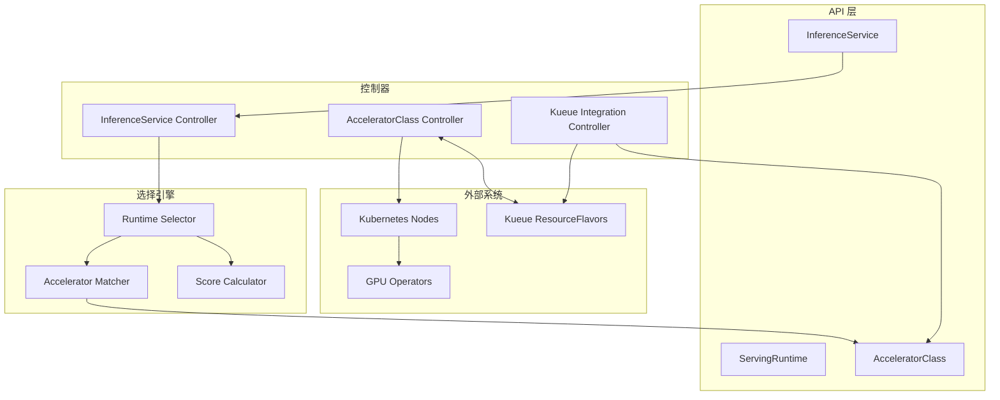

# OEP-0003: 异构 GPU 环境下的加速器感知运行时选择

<!--
本 OEP 提出了一个新的加速器抽象层，用于 OME 更好地处理异构 GPU 环境，
减少运行时的激增，同时保持与现有 Kubernetes 生态系统工具（如 Kueue）的兼容性。
-->

<!-- toc -->
- [概述](#概述)
- [动机](#动机)
  - [目标](#目标)
  - [非目标](#非目标)
- [提案](#提案)
  - [用户故事](#用户故事)
    - [故事 1: 部署模型的 ML 实践者](#故事-1-部署模型的-ml-实践者)
    - [故事 2: 管理多种 GPU 类型的平台工程师](#故事-2-管理多种-gpu-类型的平台工程师)
    - [故事 3: Kueue 重度用户](#故事-3-kueue-重度用户)
  - [注意事项/约束/注意点](#注意事项约束注意点)
  - [风险和缓解措施](#风险和缓解措施)
- [设计细节](#设计细节)
  - [API 规范](#api-规范)
    - [AcceleratorClass](#acceleratorclass)
    - [InferenceService 扩展](#inferenceservice-扩展)
    - [ServingRuntime 扩展](#servingruntime-扩展)
  - [Kueue 集成](#kueue-集成)
  - [覆盖层次结构](#覆盖层次结构)
  - [实现架构](#实现架构)
  - [测试计划](#测试计划)
    - [单元测试](#单元测试)
    - [集成测试](#集成测试)
  - [毕业标准](#毕业标准)
- [实施历史](#实施历史)
- [缺点](#缺点)
- [备选方案](#备选方案)
<!-- /toc -->

## 概述

本 OEP 为 OME 引入了 AcceleratorClass 抽象，以在异构 GPU 环境中实现智能运行时选择。目前，支持多种 GPU 类型（例如 H100、A100、B200、H200）需要创建大量运行时配置——这种组合爆炸变得难以管理。提出的解决方案提供了一种与供应商无关的方式来定义加速器能力，并自动将其与适当的运行时匹配。

该设计与现有 Kubernetes 生态系统工具（特别是 Kueue 的 ResourceFlavor 概念）无缝集成，使用户能够利用现有的资源管理基础设施。通过引入基于能力的匹配而不是硬编码特定的 GPU 型号，系统在新加速器类型出现时保持灵活性和面向未来。

## 动机

OME 当前的运行时选择机制根据模型特征（格式、架构、大小、量化）匹配运行时，但缺乏对底层硬件加速器的感知。在具有异构 GPU 类型的集群中，这种限制迫使运维人员为每种 GPU 型号创建和维护单独的运行时定义——导致运维复杂性和配置漂移。

此外，GPU 供应商（NVIDIA、AMD、Intel）在命名约定和资源暴露方面缺乏标准化，这使得构建统一解决方案具有挑战性。每个供应商使用不同的标签方案，Kubernetes 设备插件以不同方式暴露资源（例如 nvidia.com/gpu 与 amd.com/gpu）。

### 目标

1. **减少运行时激增** - 使单个运行时定义能够跨多种 GPU 类型工作
2. **供应商无关设计** - 支持 NVIDIA、AMD、Intel 和未来的加速器，无需代码更改
3. **Kueue 集成** - 与现有 Kueue ResourceFlavor 部署无缝协作
4. **渐进式披露** - 对基本用例简单，对高级场景强大
5. **自动优化** - 根据模型需求和可用性选择最佳 GPU
6. **清晰的覆盖层次结构** - 提供可预测的配置优先级

### 非目标

1. **GPU 虚拟化** - 本 OEP 不涉及 GPU 共享或 MIG 配置
2. **成本优化** - 虽然设计支持成本感知调度，但实现成本模型不在范围内
3. **动态运行时生成** - 根据发现的 GPU 自动创建新的运行时配置
4. **替换现有 API** - 设计是扩展而不是替换当前的运行时选择

## 提案

引入新的 API 资源和扩展以实现加速器感知的运行时选择：

1. **AcceleratorClass**（集群范围）- 定义加速器能力和发现模式
2. **Runtime/InferenceService 扩展** - 添加加速器需求和选择字段

注意：考虑了 AcceleratorProfile，但为了减少初始复杂性而推迟。相同的功能可以通过 InferenceService 的 acceleratorSelector 字段实现。

系统将自动发现可用的加速器，将它们与运行时需求匹配，并根据模型特征和用户偏好选择最优配置。

### 用户故事

#### 故事 1: 部署模型的 ML 实践者

Alice 想要部署一个 Llama 7B 模型进行推理。她不知道 GPU 类型之间的差异，只想让她的模型高效运行。

**当前体验：**
```yaml
# Alice 使用自动选择的运行时进行部署
kind: InferenceService
metadata:
  name: llama-7b
spec:
  model:
    name: llama-7b
  # 运行时根据模型自动选择，但不考虑 GPU 类型
  # 结果：可能被调度到任何可用的 GPU（A100、H100 等）
  # 问题：无法控制 GPU 选择，可能导致资源使用效率低下
```

**新体验：**
```yaml
# Alice 只指定她需要的内容
kind: InferenceService
metadata:
  name: llama-7b
spec:
  model:
    name: llama-7b
  runtime:
    name: sglang-universal  # 自动选择适当的 GPU
```

#### 故事 2: 管理多种 GPU 类型的平台工程师

Bob 管理一个包含 A100-40GB、A100-80GB、H100-80GB 和 H200-96GB GPU 的集群。他需要支持多种模型架构，而不创建 16+ 个运行时配置。

**当前体验：**
```yaml
# Bob 创建一个在所有 GPU 上工作的运行时，但无法针对每种 GPU 类型进行优化
kind: ServingRuntime
metadata:
  name: sglang-all-gpus
spec:
  supportedModelFormats:
    - name: safetensors
  containers:
  - name: sglang
    env:
    # 必须使用在最小 GPU 上工作的保守设置
    - name: GPU_MEMORY_UTILIZATION
      value: "0.85"  # 对所有 GPU 保守
    - name: MAX_MODEL_LEN  
      value: "16384" # 受最小 GPU 限制
    # 无法启用 H100 特定的优化，如 FP8
```

**新体验：**
```yaml
# Bob 创建一个通用运行时
kind: ServingRuntime
metadata:
  name: sglang-universal
spec:
  supportedModelFormats:
    - name: safetensors
      autoSelect: true
  
  acceleratorRequirements:
    requiredCapabilities:
      minComputeCapability: "8.0"
      requiredFeatures: ["tensor-cores"]
    
  # GPU 特定优化
  acceleratorConfigurations:
    - selector:
        acceleratorClass: nvidia-a100-40gb
      env:
        - name: TENSOR_PARALLEL_SIZE
          value: "2"
        - name: GPU_MEMORY_UTILIZATION
          value: "0.90"
        - name: MAX_MODEL_LEN
          value: "16384"
      runner:
        args:
          - "--enable-prefix-caching"
          
    - selector:
        acceleratorClass: nvidia-h100-80gb
      env:
        - name: TENSOR_PARALLEL_SIZE
          value: "1"
        - name: ENABLE_FP8
          value: "true"
        - name: GPU_MEMORY_UTILIZATION
          value: "0.95"
        - name: MAX_MODEL_LEN
          value: "32768"
      runner:
        args:
          - "--enable-prefix-caching"
          - "--enable-chunked-prefill"
          - "--speculative-model=llama-68m"  # 启用推测解码
```

#### 故事 3: Kueue 重度用户

Carol 的组织广泛使用 Kueue 进行资源管理，ResourceFlavor 已经定义。她希望 OME 利用现有的 Kueue 配置。

**新体验：**
```yaml
# 现有的 Kueue ResourceFlavor
apiVersion: kueue.x-k8s.io/v1beta1
kind: ResourceFlavor
metadata:
  name: gpu-nvidia-a100
spec:
  nodeLabels:
    nvidia.com/gpu.product: "A100-SXM4-40GB"

---
# OME 自动发现并创建 AcceleratorClass
apiVersion: ome.io/v1beta1
kind: AcceleratorClass
metadata:
  name: gpu-nvidia-a100
  annotations:
    ome.io/kueue-resource-flavor: "gpu-nvidia-a100"
spec:
  # 从 Kueue ResourceFlavor 自动填充
  nodeSelector:
    nvidia.com/gpu.product: "A100-SXM4-40GB"
  capabilities:
    memoryGB: 40
    computeCapability: "8.0"
```

#### 故事 4: 复杂的节点选择需求

Dave 需要部署一个需要 H100 GPU 的模型，但必须在特定可用区运行以实现数据局部性。

**新体验：**
```yaml
# AcceleratorClass 定义 GPU 需求
apiVersion: ome.io/v1beta1
kind: AcceleratorClass
metadata:
  name: nvidia-h100-80gb
spec:
  discovery:
    nodeSelector:
      nvidia.com/gpu.product: "H100-SXM5-80GB"

---
# InferenceService 添加额外约束
apiVersion: ome.io/v1beta1
kind: InferenceService
metadata:
  name: llama-70b
spec:
  model:
    name: llama-70b
  runtime:
    name: sglang-universal
  acceleratorSelector:
    preferredClasses: ["nvidia-h100-80gb"]
  engine:
    # 此 nodeSelector 与 AcceleratorClass nodeSelector 合并
    nodeSelector:
      topology.kubernetes.io/zone: "us-west-2a"  # 数据局部性需求
      compliance: "pci"  # 合规性需求
    # 最终的 nodeSelector 将是：
    # {
    #   "nvidia.com/gpu.product": "H100-SXM5-80GB",  # 来自 AcceleratorClass
    #   "topology.kubernetes.io/zone": "us-west-2a",  # 来自 InferenceService
    #   "compliance": "pci"                           # 来自 InferenceService
    # }
```

#### 故事 5: 成本优化的路由器部署

Emma 希望确保路由器在便宜的 CPU 节点上运行，而引擎在 GPU 节点上运行。

**新体验：**
```yaml
apiVersion: ome.io/v1beta1
kind: InferenceService
metadata:
  name: llama-7b-with-router
spec:
  model:
    name: llama-7b
  runtime:
    name: sglang-universal
    
  # 路由器配置 - 仅 CPU
  router:
    nodeSelector:
      node-type: "cpu-only"  # 明确调度到 CPU 节点
      instance-type: "spot"  # 使用便宜的竞价实例
    resources:
      requests:
        cpu: "2"
        memory: "4Gi"
      limits:
        cpu: "4"
        memory: "8Gi"
        # 未指定 GPU 资源
  
  # 引擎配置 - 需要 GPU
  engine:
    # AcceleratorClass nodeSelector 将在此处合并
    # 但不会应用到路由器
    acceleratorConfigurations:
      - selector:
          acceleratorClass: nvidia-a100-40gb
        resources:
          limits:
            nvidia.com/gpu: 1
  
  # 加速器选择仅影响引擎/解码器
  acceleratorSelector:
    preferredClasses: ["nvidia-a100-40gb"]
```

#### 故事 6: 成本优化的模型服务

Frank 希望通过对小请求使用 A100，对需要性能的大请求仅使用 H100 来优化成本。

**新体验：**
```yaml
apiVersion: ome.io/v1beta1
kind: ServingRuntime
metadata:
  name: sglang-cost-optimized
spec:
  supportedModelFormats:
    - name: safetensors
      autoSelect: true
  
  # 定义成本感知偏好
  acceleratorRequirements:
    preferenceOrder:
      - class: nvidia-a100-40gb
        score: 100
        conditions:
          - modelSize: "<30B"
          - requestSize: "<2048"  # 小请求偏好更便宜的 GPU
      - class: nvidia-h100-80gb
        score: 100
        conditions:
          - modelSize: ">70B"
          - requestSize: ">4096"  # 大请求需要 H100 性能
  
  # 每个 GPU 的成本优化配置
  acceleratorConfigurations:
    - selector:
        acceleratorClass: nvidia-a100-40gb
      env:
        - name: MAX_BATCH_SIZE
          value: "32"  # 保守的批处理
        - name: QUANTIZATION
          value: "awq"  # 使用量化以在 A100 上容纳更多
      
    - selector:
        acceleratorClass: nvidia-h100-80gb
      env:
        - name: MAX_BATCH_SIZE
          value: "256"  # 积极的批处理以提高吞吐量
        - name: QUANTIZATION
          value: "fp8"  # 使用 H100 的原生 FP8 支持

---
# InferenceService 可以指定成本偏好
apiVersion: ome.io/v1beta1
kind: InferenceService
metadata:
  name: cost-sensitive-deployment
spec:
  model:
    name: llama-13b
  runtime:
    name: sglang-cost-optimized
  acceleratorSelector:
    strategy: cost  # 偏好成本而非性能
    annotations:
      ome.io/cost-threshold: "0.5"  # $/小时阈值
```

#### 故事 7: 高级性能优化

Grace 需要根据 GPU 能力部署具有推测解码和高级量化技术的模型。

**新体验：**
```yaml
apiVersion: ome.io/v1beta1
kind: ServingRuntime
metadata:
  name: sglang-performance-optimized
spec:
  supportedModelFormats:
    - name: safetensors
      autoSelect: true
  
  acceleratorConfigurations:
    # A100 配置 - 由于内存限制，没有推测解码
    - selector:
        acceleratorClass: nvidia-a100-40gb
      env:
        - name: QUANTIZATION_METHOD
          value: "awq"  # 4 位量化以提高内存效率
        - name: ENABLE_LORA
          value: "true"
        - name: KV_CACHE_DTYPE
          value: "fp16"
      runner:
        args:
          - "--enable-prefix-caching"
          - "--enable-cuda-graph"
    
    # H100 配置 - 完整优化功能
    - selector:
        acceleratorClass: nvidia-h100-80gb
      env:
        - name: QUANTIZATION_METHOD
          value: "fp8"  # 原生 H100 FP8
        - name: ENABLE_SPECULATIVE_DECODING
          value: "true"
        - name: DRAFT_MODEL
          value: "llama-68m"  # 用于推测的小草稿模型
        - name: SPECULATION_LENGTH
          value: "5"
        - name: KV_CACHE_DTYPE
          value: "fp8"
      runner:
        args:
          - "--enable-prefix-caching"
          - "--enable-cuda-graph"
          - "--enable-chunked-prefill"
          - "--num-speculative-tokens=5"
          - "--spec-decoding-acceptance-method=typical"
    
    # H200 配置 - 最大性能
    - selector:
        acceleratorClass: nvidia-h200-96gb
      env:
        - name: QUANTIZATION_METHOD
          value: "fp8"
        - name: ENABLE_SPECULATIVE_DECODING
          value: "true"
        - name: DRAFT_MODEL
          value: "llama-160m"  # 更大的草稿模型
        - name: TENSOR_PARALLEL_SIZE
          value: "1"  # 单个 GPU 有足够的内存
        - name: MAX_MODEL_LEN
          value: "65536"  # 更多内存支持更长的上下文
      runner:
        args:
          - "--enable-prefix-caching"
          - "--enable-cuda-graph" 
          - "--enable-chunked-prefill"
          - "--num-speculative-tokens=7"
          - "--enable-flashinfer"  # H200 优化内核
```

#### 故事 8: 带加速器优化的自定义命令

Henry 有一个复杂的 sglang 部署，带有自定义命令，但希望应用 GPU 特定的优化。

**场景 1: 用户提供完整命令（不应用加速器参数）**
```yaml
apiVersion: ome.io/v1beta1
kind: InferenceService
metadata:
  name: custom-command-deployment
spec:
  engine:
    runner:
      # 用户通过 command 拥有完全控制
      command:
        - sh
        - -c
        - >
          python3 -m sglang.launch_server 
          --host 0.0.0.0 --port 8080 
          --model-path ${MODEL_PATH} 
          --tp-size 16 
          --nccl-init $(LWS_LEADER_ADDRESS):5000 
          --nnodes ${LWS_GROUP_SIZE} 
          --node-rank ${LWS_WORKER_INDEX} 
          --trust-remote-code 
          --enable-torch-compile 
          --torch-compile-max-bs 1 
          --reasoning-parser deepseek-r1 
          --enable-metrics
  # 即使有 acceleratorSelector，来自 acceleratorConfigurations 的参数也不会应用
  # 因为用户指定了 command
  acceleratorSelector:
    preferredClasses: ["nvidia-h100-80gb"]
```

**场景 2: 用户提供 args 数组（加速器参数被追加）**
```yaml
apiVersion: ome.io/v1beta1
kind: InferenceService
metadata:
  name: args-merge-deployment
spec:
  engine:
    runner:
      # 用户参数
      args:
        - "--host=0.0.0.0"
        - "--port=8080"
        - "--model-path=${MODEL_PATH}"
        - "--tp-size=8"
        - "--trust-remote-code"
  
  runtime:
    name: sglang-performance-optimized
  
  acceleratorSelector:
    preferredClasses: ["nvidia-h100-80gb"]
  
  # 结果：最终的 args 将是：
  # ["--host=0.0.0.0", "--port=8080", "--model-path=${MODEL_PATH}", 
  #  "--tp-size=8", "--trust-remote-code",
  #  "--enable-prefix-caching", "--enable-cuda-graph",  # 来自 acceleratorConfig
  #  "--enable-chunked-prefill", "--num-speculative-tokens=5",
  #  "--spec-decoding-acceptance-method=typical"]
```

**场景 3: 环境变量合并**
```yaml
apiVersion: ome.io/v1beta1
kind: InferenceService
metadata:
  name: env-merge-deployment
spec:
  engine:
    runner:
      env:
        - name: TENSOR_PARALLEL_SIZE
          value: "4"  # 用户覆盖
        - name: CUSTOM_SETTING
          value: "user-value"
  
  runtime:
    name: sglang-performance-optimized
  
  acceleratorSelector:
    preferredClasses: ["nvidia-h100-80gb"]
  
  # 结果：最终的 env 将包括：
  # TENSOR_PARALLEL_SIZE=4（用户值获胜）
  # CUSTOM_SETTING=user-value（用户定义）
  # ENABLE_FP8=true（来自 acceleratorConfig，未被覆盖）
  # GPU_MEMORY_UTILIZATION=0.95（来自 acceleratorConfig）
```

### 注意事项/约束/注意点

1. **Kueue 集成：** 当存在 Kueue ResourceFlavor 时，OME 可以自动发现并创建相应的 AcceleratorClass。这确保了一致性并减少重复配置。

2. **供应商差异：** 不同的 GPU 供应商以不同方式暴露资源（nvidia.com/gpu、amd.com/gpu）。AcceleratorClass 抽象透明地处理这些差异。

3. **覆盖优先级：** 配置遵循清晰的层次结构：ServingRuntime 默认值 → AcceleratorClass 配置 → InferenceService 规范 → Pod 注解

4. **向后兼容性：** 现有的 InferenceService 继续工作。新字段是可选的，仅在使用时增强功能。

5. **与现有 NodeSelector/Affinity 的交互：** ServingRuntime 和 InferenceService 都已经有 `nodeSelector` 和 `affinity` 字段。AcceleratorClass 系统的工作方式如下：
   - AcceleratorClass 定义特定 GPU 类型的节点选择标准
   - 这些与现有的 nodeSelector/affinity 设置合并
   - InferenceService 中用户指定的 nodeSelector/affinity 优先

6. **组件架构：** OME 使用单独的 Engine、Decoder 和 Router 组件：
   - Engine 和 Decoder 可以有不同的 AcceleratorClass 选择
   - Router 通常仅运行 CPU，不应用加速器配置
   - 组件从控制器接收已合并的规范

7. **容器参数合并：** 遵循 OME 的现有行为：
   - 运行时参数和用户参数是连接的，而不是合并的
   - 加速器参数被前置到运行时参数
   - 如果用户指定 `command`，则不应用加速器参数
   - 如果用户指定 `args`，它们将在加速器参数之后追加
   - 当选择加速器时，其 nodeSelector 与现有 nodeSelector **合并**
   - 亲和性规则使用 AND 逻辑组合
   - InferenceService 中的直接 nodeSelector/affinity 优先于 AcceleratorClass
   - 这允许用户在 GPU 类型之外进一步约束放置

6. **路由器组件处理：** 路由器组件仅使用 CPU，不需要 GPU：
   - AcceleratorClass 约束**仅应用于 Engine 和 Decoder** 组件
   - Router pod 保持自己独立的 nodeSelector/affinity 设置
   - 这防止路由器被不必要地调度到昂贵的 GPU 节点上
   - 可以明确将路由器调度到仅 CPU 的节点以优化成本

7. **容器参数合并：** 当 acceleratorConfigurations 指定 args 且用户也提供 command/args 时：
   - 如果用户指定 `command`，加速器参数**不会应用**（用户拥有完全控制）
   - 如果用户指定 `args` 作为数组，加速器参数被**追加**
   - 环境变量被**合并**（用户值优先）
   - 资源被**合并**（取用户和加速器值的最大值）

### 风险和缓解措施

**风险 1: 简单用例的复杂性**
- *缓解:* 所有新字段都是可选的。用户可以继续使用现有的简单配置。

**风险 2: 与 Kueue ResourceFlavor 冲突**
- *缓解:* 提供自动发现和与 Kueue ResourceFlavor 的同步。允许双向映射。

**风险 3: 选择中的性能开销**
- *缓解:* 缓存加速器发现结果。使用高效的匹配算法。

**风险 4: 通过能力定义的供应商锁定**
- *缓解:* 使用通用能力名称。允许供应商特定的扩展，但不要求它们。

## 设计细节

### AcceleratorClass 定义示例

用户或平台管理员将为其 GPU 类型创建 AcceleratorClass 资源。以下是常见示例：

```yaml
# NVIDIA A100 40GB
apiVersion: ome.io/v1beta1
kind: AcceleratorClass
metadata:
  name: nvidia-a100-40gb
spec:
  vendor: nvidia
  family: ampere
  model: a100
  
  discovery:
    nodeSelector:
      nvidia.com/gpu.product: "NVIDIA-A100-SXM4-40GB"
    # 替代发现模式
    nodeSelectorTerms:
      - matchExpressions:
        - key: nvidia.com/gpu.product
          operator: In
          values: ["NVIDIA-A100-SXM4-40GB", "NVIDIA-A100-PCIE-40GB"]
    pciVendorID: "10de"
    deviceIDs: ["20b0", "20b2"]  # 不同的 A100 变体
  
  capabilities:
    memoryGB: "40Gi"
    computeCapability: "8.0"
    memoryBandwidthGBps: "1555"
    features:
      - tensor-cores
      - mig-3g.20gb
      - mig-7g.40gb
      - nvlink
    performance:
      fp16TFLOPS: 312
      fp32TFLOPS: 156
      int8TOPS: 624
  
  resources:
    - name: nvidia.com/gpu
      quantity: "1"
    - name: nvidia.com/mig-3g.20gb
      quantity: "2"
      divisible: true
  
  cost:
    perHour: "2.21"  # 当前云定价
    spotPerHour: "0.88"
    tier: "medium"

---
# NVIDIA H100 80GB
apiVersion: ome.io/v1beta1
kind: AcceleratorClass
metadata:
  name: nvidia-h100-80gb
spec:
  vendor: nvidia
  family: hopper
  model: h100
  
  discovery:
    nodeSelector:
      nvidia.com/gpu.product: "NVIDIA-H100-80GB-HBM3"
    pciVendorID: "10de"
    deviceIDs: ["2330"]
  
  capabilities:
    memoryGB: "80Gi"
    computeCapability: "9.0"
    memoryBandwidthGBps: "3350"
    features:
      - tensor-cores
      - transformer-engine
      - fp8
      - mig-7g.80gb
      - nvlink-4
    performance:
      fp8TFLOPS: 3958  # 带稀疏性
      fp16TFLOPS: 1979
      fp32TFLOPS: 989
  
  resources:
    - name: nvidia.com/gpu
      quantity: "1"
  
  cost:
    perHour: "5.12"  # 新 GPU 的更高成本
    spotPerHour: "2.05"
    tier: "high"

---
# AMD MI250X
apiVersion: ome.io/v1beta1
kind: AcceleratorClass
metadata:
  name: amd-mi250x
spec:
  vendor: amd
  family: cdna2
  model: mi250x
  
  discovery:
    nodeSelector:
      amd.com/gpu.product: "MI250X"
    # AMD 使用不同的标签
    nodeSelectorTerms:
      - matchExpressions:
        - key: gpu.amd.com/model
          operator: In
          values: ["mi250x", "MI250X"]
  
  capabilities:
    memoryGB: "128Gi"  # 2x64GB
    rocmVersion: "5.7"
    memoryBandwidthGBps: "3276"
    features:
      - matrix-cores
      - infinity-fabric
    performance:
      fp16TFLOPS: 383
      fp32TFLOPS: 47.9
  
  resources:
    - name: amd.com/gpu
      quantity: "1"

---
# Intel Data Center GPU Max 1550
apiVersion: ome.io/v1beta1
kind: AcceleratorClass
metadata:
  name: intel-max-1550
spec:
  vendor: intel
  family: ponte-vecchio
  model: max-1550
  
  discovery:
    nodeSelector:
      gpu.intel.com/product: "max-1550"
  
  capabilities:
    memoryGB: "128Gi"
    levelZeroVersion: "1.3"
    features:
      - xmx-engines
      - ray-tracing
  
  resources:
    - name: gpu.intel.com/i915
      quantity: "1"
```

### 平台提供的基本集

平台团队通常会提供一组基本的 AcceleratorClass：

```yaml
# 平台团队的简化示例
apiVersion: v1
kind: ConfigMap
metadata:
  name: accelerator-classes-base
  namespace: ome-system
data:
  accelerator-classes.yaml: |
    # 用于开发/测试的小型 GPU
    ---
    apiVersion: ome.io/v1beta1
    kind: AcceleratorClass
    metadata:
      name: small-gpu
      labels:
        ome.io/gpu-tier: "small"
    spec:
      discovery:
        nodeSelectorTerms:
          - matchExpressions:
            - key: nvidia.com/gpu.memory
              operator: Lt
              values: ["24Gi"]
      capabilities:
        memoryGB: "16Gi"
        features: ["tensor-cores"]
    
    # 用于标准工作负载的中型 GPU
    ---
    apiVersion: ome.io/v1beta1
    kind: AcceleratorClass
    metadata:
      name: medium-gpu
      labels:
        ome.io/gpu-tier: "medium"
    spec:
      discovery:
        nodeSelectorTerms:
          - matchExpressions:
            - key: nvidia.com/gpu.memory
              operator: Gte
              values: ["32Gi"]
            - key: nvidia.com/gpu.memory
              operator: Lt
              values: ["80Gi"]
      capabilities:
        memoryGB: "40Gi"
        minComputeCapability: "8.0"
    
    # 用于大型模型的大型 GPU
    ---
    apiVersion: ome.io/v1beta1
    kind: AcceleratorClass
    metadata:
      name: large-gpu
      labels:
        ome.io/gpu-tier: "large"
    spec:
      discovery:
        nodeSelectorTerms:
          - matchExpressions:
            - key: nvidia.com/gpu.memory
              operator: Gte
              values: ["80Gi"]
      capabilities:
        memoryGB: "80Gi"
        minComputeCapability: "8.0"
```

### 自动发现示例

平台还可以自动发现并创建 AcceleratorClass：

```go
// 自动发现控制器的伪代码
func (r *AcceleratorDiscoveryReconciler) discoverGPUs(ctx context.Context) error {
    nodes := &v1.NodeList{}
    if err := r.List(ctx, nodes); err != nil {
        return err
    }
    
    discoveredGPUs := make(map[string]*AcceleratorClassSpec)
    
    for _, node := range nodes.Items {
        // 检查 NVIDIA GPU
        if product, ok := node.Labels["nvidia.com/gpu.product"]; ok {
            if _, exists := discoveredGPUs[product]; !exists {
                spec := r.createNvidiaAcceleratorSpec(node.Labels)
                discoveredGPUs[product] = spec
            }
        }
        
        // 检查 AMD GPU
        if product, ok := node.Labels["amd.com/gpu.product"]; ok {
            if _, exists := discoveredGPUs[product]; !exists {
                spec := r.createAMDAcceleratorSpec(node.Labels)
                discoveredGPUs[product] = spec
            }
        }
    }
    
    // 为每个发现的 GPU 类型创建 AcceleratorClass
    for name, spec := range discoveredGPUs {
        ac := &AcceleratorClass{
            ObjectMeta: metav1.ObjectMeta{
                Name: sanitizeName(name),
                Labels: map[string]string{
                    "ome.io/auto-discovered": "true",
                },
            },
            Spec: *spec,
        }
        if err := r.Create(ctx, ac); err != nil && !errors.IsAlreadyExists(err) {
            return err
        }
    }
    
    return nil
}
```

### API 规范

#### AcceleratorClass

```go
// AcceleratorClass 定义具有相似能力的一类加速器
// +kubebuilder:object:root=true
// +kubebuilder:resource:scope=Cluster
// +kubebuilder:subresource:status
// +kubebuilder:printcolumn:name="Vendor",type=string,JSONPath=`.spec.vendor`
// +kubebuilder:printcolumn:name="Family",type=string,JSONPath=`.spec.family`
// +kubebuilder:printcolumn:name="Memory",type=string,JSONPath=`.spec.capabilities.memoryGB`
// +kubebuilder:printcolumn:name="Nodes",type=integer,JSONPath=`.status.availableNodes`
type AcceleratorClass struct {
    metav1.TypeMeta   `json:",inline"`
    metav1.ObjectMeta `json:"metadata,omitempty"`
    
    Spec   AcceleratorClassSpec   `json:"spec,omitempty"`
    Status AcceleratorClassStatus `json:"status,omitempty"`
}

type AcceleratorClassSpec struct {
    // 加速器供应商（nvidia、amd、intel 等）
    // +optional
    Vendor string `json:"vendor,omitempty"`
    
    // 加速器系列（ampere、hopper、cdna2 等）
    // +optional
    Family string `json:"family,omitempty"`
    
    // 型号名称（a100、h100、mi250x 等）
    // +optional
    Model string `json:"model,omitempty"`
    
    // 识别具有此加速器的节点的发现模式
    Discovery AcceleratorDiscovery `json:"discovery"`
    
    // 此加速器类的能力
    Capabilities AcceleratorCapabilities `json:"capabilities"`
    
    // 此加速器暴露的资源
    // +optional
    Resources []AcceleratorResource `json:"resources,omitempty"`
    
    // 与外部系统的集成
    // +optional
    Integration *AcceleratorIntegration `json:"integration,omitempty"`
    
    // 用于优化决策的成本信息
    // +optional
    Cost *AcceleratorCost `json:"cost,omitempty"`
}

type AcceleratorCost struct {
    // 每小时成本（美元）
    // +optional
    PerHour *resource.Quantity `json:"perHour,omitempty"`
    
    // 每百万 token 成本（用于基于使用的定价）
    // +optional
    PerMillionTokens *resource.Quantity `json:"perMillionTokens,omitempty"`
    
    // 竞价实例定价（如果可用）
    // +optional
    SpotPerHour *resource.Quantity `json:"spotPerHour,omitempty"`
    
    // 用于简化选择的成本层级（low、medium、high）
    // +optional
    Tier string `json:"tier,omitempty"`
}

type AcceleratorDiscovery struct {
    // 用于识别具有此加速器的节点的 NodeSelector
    // +optional
    NodeSelector map[string]string `json:"nodeSelector,omitempty"`
    
    // 用于更复杂节点选择的 NodeSelectorTerms
    // +optional
    NodeSelectorTerms []v1.NodeSelectorTerm `json:"nodeSelectorTerms,omitempty"`
    
    // 用于设备发现的 PCI 供应商 ID（例如，NVIDIA 的 "10de"）
    // +optional
    PCIVendorID string `json:"pciVendorID,omitempty"`
    
    // PCI 设备 ID 列表
    // +optional
    DeviceIDs []string `json:"deviceIDs,omitempty"`
}

type AcceleratorCapabilities struct {
    // 内存容量（GB）
    // +optional
    MemoryGB *resource.Quantity `json:"memoryGB,omitempty"`
    
    // 计算能力（NVIDIA）或等效值
    // +optional
    ComputeCapability string `json:"computeCapability,omitempty"`
    
    // 时钟速度
    // +optional
    ClockSpeedMHz *int32 `json:"clockSpeedMHz,omitempty"`
    
    // 内存带宽
    // +optional
    MemoryBandwidthGBps *resource.Quantity `json:"memoryBandwidthGBps,omitempty"`
    
    // 此加速器支持的功能
    // +optional
    Features []string `json:"features,omitempty"`
    
    // 性能指标
    // +optional
    Performance *AcceleratorPerformance `json:"performance,omitempty"`
}

type AcceleratorResource struct {
    // 资源名称（例如 nvidia.com/gpu）
    Name string `json:"name"`
    
    // 每个加速器的数量
    // +kubebuilder:default="1"
    Quantity resource.Quantity `json:"quantity,omitempty"`
    
    // Divisible 表示资源是否可以细分
    // +optional
    Divisible bool `json:"divisible,omitempty"`
}

type AcceleratorIntegration struct {
    // 要同步的 Kueue ResourceFlavor 名称
    // +optional
    KueueResourceFlavor string `json:"kueueResourceFlavor,omitempty"`
    
    // 用于 Volcano 集成的 VolcanoGPUType
    // +optional
    VolcanoGPUType string `json:"volcanoGPUType,omitempty"`
}

type AcceleratorClassStatus struct {
    // 具有此加速器的节点
    // +optional
    Nodes []string `json:"nodes,omitempty"`
    
    // 集群中加速器的总数
    // +optional
    TotalAccelerators int32 `json:"totalAccelerators,omitempty"`
    
    // 可用加速器（未分配）
    // +optional
    AvailableAccelerators int32 `json:"availableAccelerators,omitempty"`
    
    // 最后更新时间
    // +optional
    LastUpdated metav1.Time `json:"lastUpdated,omitempty"`
    
    // Conditions 表示最新的可用观察
    // +optional
    Conditions []metav1.Condition `json:"conditions,omitempty"`
}
```

#### InferenceService 扩展

```go
// 更新 inference_service.go 中的 InferenceServiceSpec
type InferenceServiceSpec struct {
    // 现有字段...
    Engine  *EngineSpec  `json:"engine,omitempty"`
    Decoder *DecoderSpec `json:"decoder,omitempty"`
    Model   *ModelRef    `json:"model,omitempty"`
    Runtime *ServingRuntimeRef `json:"runtime,omitempty"`
    Router  *RouterSpec  `json:"router,omitempty"`
    
    // 新增：加速器选择偏好
    // +optional
    AcceleratorSelector *AcceleratorSelector `json:"acceleratorSelector,omitempty"`
}

type AcceleratorSelector struct {
    // 按偏好顺序排列的 PreferredClasses
    // +optional
    PreferredClasses []string `json:"preferredClasses,omitempty"`
    
    // 必须满足的 RequiredCapabilities
    // +optional
    RequiredCapabilities *AcceleratorCapabilities `json:"requiredCapabilities,omitempty"`
    
    // 选择策略（performance、cost、balanced）
    // +kubebuilder:default="balanced"
    // +optional
    Strategy AcceleratorSelectionStrategy `json:"strategy,omitempty"`
    
    // 用于特定节点定位的 NodeSelector
    // +optional
    NodeSelector map[string]string `json:"nodeSelector,omitempty"`
    
    // 选择策略（performance、cost、balanced）
    // +kubebuilder:default="balanced"
    // +optional
    Strategy AcceleratorSelectionStrategy `json:"strategy,omitempty"`
}

// 更新 EngineSpec 以支持加速器配置
type EngineSpec struct {
    // 现有字段...
    PodSpec                `json:",inline"`
    ComponentExtensionSpec `json:",inline"`
    Runner                 *RunnerSpec `json:"runner,omitempty"`
    Leader                 *LeaderSpec `json:"leader,omitempty"`
    Worker                 *WorkerSpec `json:"worker,omitempty"`
    
    // 新增：加速器特定的配置覆盖
    // 根据所选加速器类应用
    // +optional
    AcceleratorConfigurations []AcceleratorConfiguration `json:"acceleratorConfigurations,omitempty"`
}

type AcceleratorConfiguration struct {
    // 此配置适用于哪些加速器类的选择器
    Selector AcceleratorConfigSelector `json:"selector"`
    
    // 要设置的环境变量
    // +optional
    Env []v1.EnvVar `json:"env,omitempty"`
    
    // 要请求/限制的资源
    // +optional
    Resources v1.ResourceRequirements `json:"resources,omitempty"`
    
    // Runner 覆盖
    // +optional
    Runner *RunnerSpec `json:"runner,omitempty"`
}
```

#### ServingRuntime 扩展

```go
// 更新 servingruntime_types.go 中的 ServingRuntimeSpec
type ServingRuntimeSpec struct {
    // 现有字段...
    SupportedModelFormats []SupportedModelFormat `json:"supportedModelFormats,omitempty"`
    ModelSizeRange       *ModelSizeRangeSpec     `json:"modelSizeRange,omitempty"`
    Disabled             *bool                   `json:"disabled,omitempty"`
    RouterConfig         *RouterSpec             `json:"routerConfig,omitempty"`
    EngineConfig         *EngineSpec             `json:"engineConfig,omitempty"`
    DecoderConfig        *DecoderSpec            `json:"decoderConfig,omitempty"`
    
    // 新增：此运行时的加速器需求
    // +optional
    AcceleratorRequirements *AcceleratorRequirements `json:"acceleratorRequirements,omitempty"`
}

type AcceleratorRequirements struct {
    // SupportedClasses 明确列出支持的加速器类
    // +optional
    SupportedClasses []string `json:"supportedClasses,omitempty"`
    
    // 任何加速器必须满足的 RequiredCapabilities
    // +optional
    RequiredCapabilities *AcceleratorCapabilities `json:"requiredCapabilities,omitempty"`
    
    // 加速器选择的 PreferenceOrder
    // +optional
    PreferenceOrder []AcceleratorPreference `json:"preferenceOrder,omitempty"`
}

type AcceleratorPreference struct {
    // 类名或能力匹配器
    Class string `json:"class,omitempty"`
    
    // 此偏好的分数（越高越好）
    // +kubebuilder:validation:Minimum=0
    // +kubebuilder:validation:Maximum=100
    Score int32 `json:"score"`
    
    // 此偏好适用时的条件
    // +optional
    Conditions []PreferenceCondition `json:"conditions,omitempty"`
}
```

### Kueue 集成

系统提供与 Kueue ResourceFlavor 的双向集成：

```go
// AcceleratorClassController 监视 Kueue ResourceFlavor
func (r *AcceleratorClassReconciler) Reconcile(ctx context.Context, req ctrl.Request) (ctrl.Result, error) {
    // 检查这是否是 Kueue ResourceFlavor
    if req.Namespace == "" && strings.HasPrefix(req.Name, "gpu-") {
        // 尝试获取相应的 ResourceFlavor
        rf := &kueuev1beta1.ResourceFlavor{}
        if err := r.Get(ctx, req.NamespacedName, rf); err == nil {
            // 从 ResourceFlavor 创建或更新 AcceleratorClass
            return r.syncFromResourceFlavor(ctx, rf)
        }
    }
    
    // 正常的 AcceleratorClass 协调
    ac := &omev1beta1.AcceleratorClass{}
    if err := r.Get(ctx, req.NamespacedName, ac); err != nil {
        return ctrl.Result{}, client.IgnoreNotFound(err)
    }
    
    // 如果链接到 Kueue，确保 ResourceFlavor 存在
    if ac.Spec.Integration != nil && ac.Spec.Integration.KueueResourceFlavor != "" {
        return r.ensureResourceFlavor(ctx, ac)
    }
    
    return r.updateAcceleratorStatus(ctx, ac)
}

// 从节点自动发现 GPU 能力
func (r *AcceleratorClassReconciler) discoverAcceleratorCapabilities(
    ctx context.Context,
    nodes []v1.Node,
) (*AcceleratorCapabilities, error) {
    capabilities := &AcceleratorCapabilities{
        Features: []string{},
    }
    
    for _, node := range nodes {
        // 从节点标签中提取 GPU 信息
        if memory, ok := node.Labels["nvidia.com/gpu.memory"]; ok {
            if mem, err := resource.ParseQuantity(memory); err == nil {
                capabilities.MemoryGB = &mem
            }
        }
        
        if cc, ok := node.Labels["nvidia.com/gpu.compute"]; ok {
            capabilities.ComputeCapability = cc
        }
        
        // 检查特定功能
        if _, ok := node.Labels["nvidia.com/mig.capable"]; ok {
            capabilities.Features = append(capabilities.Features, "mig")
        }
        
        if _, ok := node.Labels["nvidia.com/nvlink"]; ok {
            capabilities.Features = append(capabilities.Features, "nvlink")
        }
    }
    
    return capabilities, nil
}
```

### 覆盖层次结构

配置优先级遵循清晰的层次结构：

```go
// RuntimeSelector 实现带覆盖支持的选择逻辑
type RuntimeSelector struct {
    client            client.Client
    acceleratorCache  cache.Cache
    defaultStrategy   SelectionStrategy
}

func (s *RuntimeSelector) SelectRuntimeWithAccelerator(
    ctx context.Context,
    inferenceService *omev1beta1.InferenceService,
    model *omev1beta1.BaseModel,
) (*RuntimeSelection, error) {
    // 1. 获取基本运行时需求
    runtime, err := s.getRuntime(ctx, inferenceService)
    if err != nil {
        return nil, err
    }
    
    // 2. 构建有效的加速器需求（带覆盖）
    requirements := s.buildEffectiveRequirements(
        runtime.Spec.AcceleratorRequirements,           // 来自运行时的基础
        inferenceService.Spec.AcceleratorSelector,      // 来自 InferenceService 的覆盖
        inferenceService.Annotations,                   // 来自注解的最终覆盖
    )
    
    // 3. 查找匹配的加速器
    accelerators, err := s.findMatchingAccelerators(ctx, requirements)
    if err != nil {
        return nil, err
    }
    
    // 4. 评分并选择最佳选项
    selection := s.selectBestOption(
        runtime,
        accelerators,
        model,
        requirements.Strategy,
    )
    
    // 5. 应用加速器特定配置
    s.applyAcceleratorConfig(selection, runtime, accelerators[0])
    
    return selection, nil
}

// 覆盖优先级实现
func (s *RuntimeSelector) buildEffectiveRequirements(
    runtimeReq *AcceleratorRequirements,
    serviceSelector *AcceleratorSelector,
    annotations map[string]string,
) *EffectiveRequirements {
    req := &EffectiveRequirements{
        Strategy: s.defaultStrategy,
    }
    
    // 第 1 层：运行时默认值
    if runtimeReq != nil {
        req.SupportedClasses = runtimeReq.SupportedClasses
        req.RequiredCapabilities = runtimeReq.RequiredCapabilities
    }
    
    // 第 2 层：InferenceService 覆盖
    if serviceSelector != nil {
        if len(serviceSelector.PreferredClasses) > 0 {
            req.PreferredClasses = serviceSelector.PreferredClasses
        }
        if serviceSelector.RequiredCapabilities != nil {
            req.RequiredCapabilities = mergeCapabilities(
                req.RequiredCapabilities,
                serviceSelector.RequiredCapabilities,
            )
        }
        if serviceSelector.Strategy != "" {
            req.Strategy = serviceSelector.Strategy
        }
    }
    
    // 第 3 层：注解覆盖（最高优先级）
    if class, ok := annotations["ome.io/accelerator-class"]; ok {
        req.PreferredClasses = []string{class}
    }
    if strategy, ok := annotations["ome.io/selection-strategy"]; ok {
        req.Strategy = AcceleratorSelectionStrategy(strategy)
    }
    
    return req
}

// 从不同来源合并节点选择器
func (s *RuntimeSelector) mergeNodeSelectors(
    component string, // "engine"、"decoder" 或 "router"
    acceleratorClass *AcceleratorClass,
    runtime *ServingRuntime,
    inferenceService *InferenceService,
) map[string]string {
    merged := make(map[string]string)
    
    // 路由器组件不获取加速器约束
    if component == "router" {
        // 仅使用路由器特定的 nodeSelector
        if inferenceService.Spec.Router != nil && inferenceService.Spec.Router.NodeSelector != nil {
            for k, v := range inferenceService.Spec.Router.NodeSelector {
                merged[k] = v
            }
        }
        return merged
    }
    
    // 对于引擎和解码器组件，应用加速器约束
    
    // 1. 从 AcceleratorClass nodeSelector 开始
    if acceleratorClass != nil && acceleratorClass.Spec.Discovery.NodeSelector != nil {
        for k, v := range acceleratorClass.Spec.Discovery.NodeSelector {
            merged[k] = v
        }
    }
    
    // 2. 合并 Runtime nodeSelector（运行时可以覆盖加速器）
    if runtime != nil && runtime.Spec.NodeSelector != nil {
        for k, v := range runtime.Spec.NodeSelector {
            merged[k] = v
        }
    }
    
    // 3. 合并组件特定的 nodeSelector（最高优先级）
    var componentNodeSelector map[string]string
    switch component {
    case "engine":
        if inferenceService.Spec.Engine != nil {
            componentNodeSelector = inferenceService.Spec.Engine.NodeSelector
        }
    case "decoder":
        if inferenceService.Spec.Decoder != nil {
            componentNodeSelector = inferenceService.Spec.Decoder.NodeSelector
        }
    }
    
    if componentNodeSelector != nil {
        for k, v := range componentNodeSelector {
            merged[k] = v
        }
    }
    
    return merged
}

// 示例：nodeSelector 如何合并
// AcceleratorClass nodeSelector: {"nvidia.com/gpu.product": "A100-SXM4-40GB"}
// Runtime nodeSelector: {"node-pool": "gpu-pool"}  
// InferenceService nodeSelector: {"dedicated": "team-alpha"}
// 结果：{"nvidia.com/gpu.product": "A100-SXM4-40GB", "node-pool": "gpu-pool", "dedicated": "team-alpha"}

// 从加速器合并容器配置
func (s *RuntimeSelector) mergeContainerConfig(
    userContainer *v1.Container,
    acceleratorConfig *AcceleratorConfiguration,
) *v1.Container {
    result := userContainer.DeepCopy()
    
    // 规则 1：如果用户指定了 command，不要触碰 args
    if len(userContainer.Command) > 0 {
        // 用户拥有完全控制，跳过参数合并
        log.Info("用户指定了 command，跳过加速器 args")
    } else if acceleratorConfig.Runner != nil && len(acceleratorConfig.Runner.Args) > 0 {
        // 规则 2：将加速器 args 追加到用户 args
        result.Args = append(result.Args, acceleratorConfig.Runner.Args...)
    }
    
    // 规则 3：合并环境变量（用户值优先）
    if len(acceleratorConfig.Env) > 0 {
        envMap := make(map[string]v1.EnvVar)
        
        // 从加速器环境变量开始
        for _, env := range acceleratorConfig.Env {
            envMap[env.Name] = env
        }
        
        // 用用户环境变量覆盖
        for _, env := range userContainer.Env {
            envMap[env.Name] = env
        }
        
        // 转换回切片
        result.Env = make([]v1.EnvVar, 0, len(envMap))
        for _, env := range envMap {
            result.Env = append(result.Env, env)
        }
    }
    
    // 规则 4：合并资源（取最大值）
    if acceleratorConfig.Resources.Limits != nil {
        if result.Resources.Limits == nil {
            result.Resources.Limits = make(v1.ResourceList)
        }
        for name, quantity := range acceleratorConfig.Resources.Limits {
            if existing, ok := result.Resources.Limits[name]; ok {
                // 取较大的值
                if quantity.Cmp(existing) > 0 {
                    result.Resources.Limits[name] = quantity
                }
            } else {
                result.Resources.Limits[name] = quantity
            }
        }
    }
    
    return result
}
```

### 实现架构



### 测试计划

#### 单元测试

- `pkg/controller/acceleratorclass`: 2024-12-01 - 0%（新包）
  - 测试 AcceleratorClass CRUD 操作
  - 测试能力匹配逻辑
  - 测试 Kueue ResourceFlavor 同步
  
- `pkg/controller/inferenceservice/utils`: 2024-12-01 - 当前覆盖率
  - 添加加速器感知运行时选择的测试
  - 测试覆盖层次结构
  - 测试回退行为

- `pkg/apis/ome/v1beta1`: 2024-12-01 - 当前覆盖率
  - 添加新 API 字段的验证测试
  - 测试默认行为

#### 集成测试

1. **基本加速器选择**
   - 为不同 GPU 类型部署 AcceleratorClass
   - 创建不带加速器偏好的 InferenceService
   - 验证基于模型大小的正确 GPU 选择

2. **Kueue 集成**
   - 创建 Kueue ResourceFlavor
   - 验证自动创建 AcceleratorClass
   - 测试带加速器需求的工作负载提交

3. **覆盖行为**
   - 测试运行时默认值 → 服务 → 注解优先级
   - 验证每一层正确覆盖前一层

4. **多 GPU 场景**
   - 测试张量并行配置
   - 验证大型模型的正确 GPU 数量选择

5. **故障场景**
   - 没有可用的匹配加速器
   - 冲突的需求
   - 无效的加速器类引用

### 部署策略

组织可以选择不同的方法来管理 AcceleratorClass：

#### 选项 1: 手动管理
- 平台团队为每种 GPU 类型创建 AcceleratorClass
- 完全控制命名和能力
- 最适合已知 GPU 类型的稳定环境

#### 选项 2: 自动发现与覆盖
- 控制器自动发现 GPU 并创建基本的 AcceleratorClass
- 平台团队可以使用自定义定义覆盖
- 在自动化和控制之间取得平衡

#### 选项 3: 基于模板
- 使用 Helm chart 或 Kustomize 生成 AcceleratorClass
- 不同 GPU 系列的参数化模板
- 易于维护和更新

```yaml
# 用于生成 AcceleratorClass 的 Helm 值示例
acceleratorClasses:
  nvidia:
    - model: a100
      memory: 40Gi
      variants: ["SXM4", "PCIE"]
    - model: a100
      memory: 80Gi
      variants: ["SXM4"]
    - model: h100
      memory: 80Gi
      variants: ["SXM5", "PCIE"]
  amd:
    - model: mi250x
      memory: 128Gi
```

### 毕业标准

**Alpha (v0.3):**
- 实现基本的 AcceleratorClass API
- 运行时选择考虑加速器需求
- 需要手动创建加速器类
- 特性门：AcceleratorAwareScheduling

**Beta (v0.4):**
- 从 GPU 操作器自动发现
- Kueue ResourceFlavor 集成
- 全面的监控和指标
- 特性门默认启用

**Stable (v0.5):**
- 在 3+ 个组织中生产使用
- 2 个版本内无 API 更改
- 性能优化完成
- 从 alpha/beta 的迁移指南
- 移除特性门

## 实施历史

- 2025-07-04: 提出并讨论 OEP
- 2025-08-XX: 开始 Alpha 实现
- 2025-10-XX: 带 Kueue 集成的 Beta 版本
- 2025-12-XX: GA 版本

## 缺点

1. **额外的复杂性**: 引入用户需要理解的新 API 和概念

2. **维护开销**: 需要随着新 GPU 型号的发布保持加速器定义的更新

3. **集成复杂性**: 支持多个生态系统工具（Kueue、Volcano）增加了复杂性

4. **迁移工作**: 现有用户需要迁移以受益于新功能

## 备选方案

### 备选方案 1: 直接扩展 ServingRuntime

不使用新 API，而是将 GPU 需求直接添加到 ServingRuntime：

```yaml
spec:
  supportedGPUTypes: ["nvidia-a100", "nvidia-h100"]
  gpuConfigurations:
    nvidia-a100:
      env: [...]
```

**拒绝原因：**
- 仍然导致运行时激增
- 没有对供应商差异的抽象
- 难以与 Kueue 集成

### 备选方案 2: 节点选择器模板

在 ServingRuntime 中使用模板：

```yaml
spec:
  nodeSelectorTemplate: |
    gpu-type: {{ .GPU_TYPE }}
    gpu-memory: {{ .GPU_MEMORY }}
```

**拒绝原因：**
- 需要模板处理基础设施
- 不如显式 API 可发现
- 更难验证

### 备选方案 3: 依赖外部工具

专门使用 Kueue 或 Volcano 进行 GPU 管理：

**拒绝原因：**
- 并非所有用户都有 Kueue/Volcano
- 失去模型感知优化机会
- 需要用户理解多个系统

### 备选方案 4: 动态运行时生成

根据发现的 GPU 自动生成运行时：

**拒绝原因：**
- 可能导致运行时激增
- 难以自定义每个 GPU 的优化
- 用户的不可预测行为

所选方法在灵活性、兼容性和用户体验之间取得平衡，同时为未来的增强提供了清晰的路径。