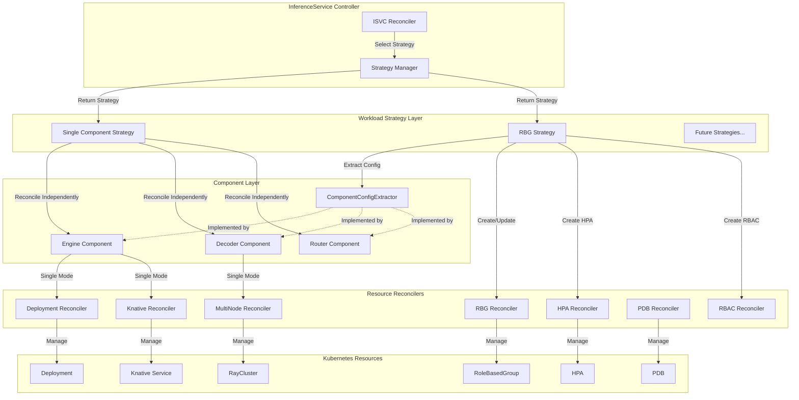
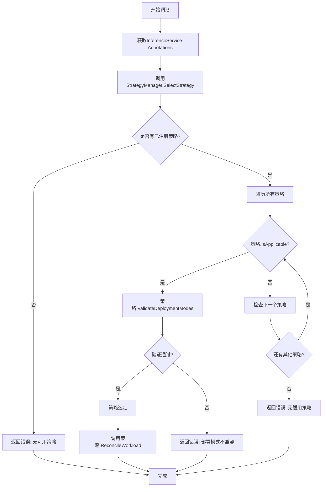
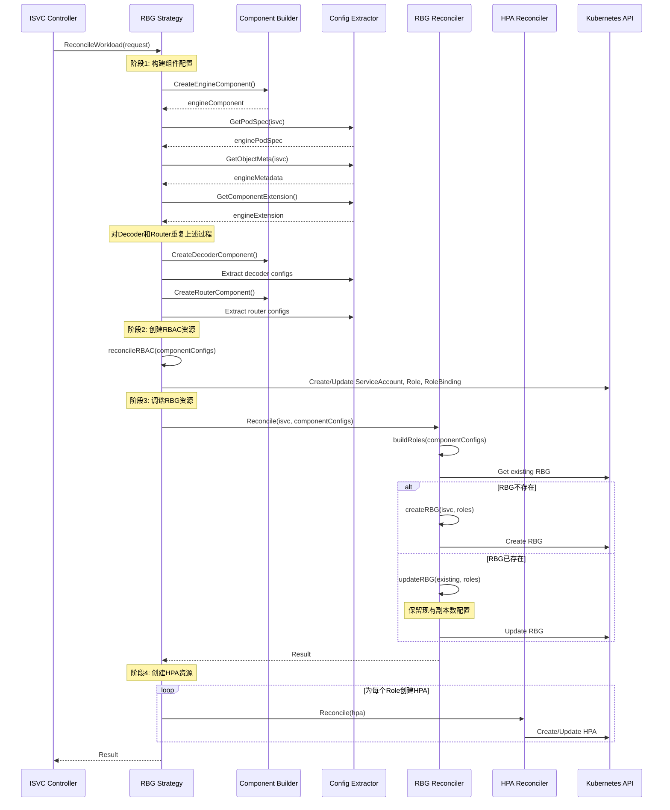
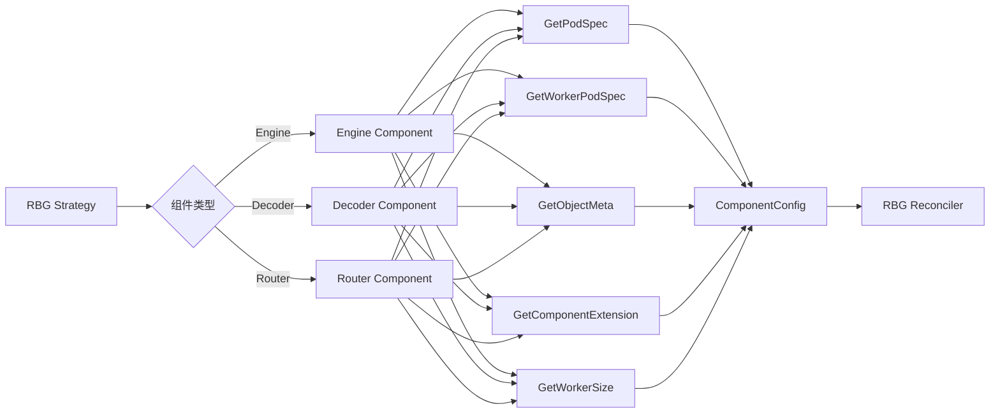

# OEP-0006: 工作负载策略层与统一工作负载管理

<!-- toc -->
- [概述](#概述)
- [动机](#动机)
  - [目标](#目标)
  - [非目标](#非目标)
- [提案](#提案)
  - [用户故事](#用户故事)
  - [注意事项与约束](#注意事项与约束)
  - [风险与缓解措施](#风险与缓解措施)
- [设计细节](#设计细节)
  - [架构概览](#架构概览)
  - [核心接口设计](#核心接口设计)
  - [策略选择机制](#策略选择机制)
  - [RBG策略实现](#rbg策略实现)
  - [组件配置提取](#组件配置提取)
  - [测试计划](#测试计划)
  - [成熟度标准](#成熟度标准)
    - [Alpha阶段](#alpha阶段)
    - [Beta阶段](#beta阶段)
    - [GA阶段](#ga阶段)
- [实现历史](#实现历史)
- [缺点](#缺点)
- [备选方案](#备选方案)
<!-- /toc -->

## 概述

本提案引入了工作负载策略层（Workload Policy Layer），为OME提供统一的工作负载管理抽象。该架构通过策略模式将工作负载管理逻辑与角色调谐逻辑解耦，支持单角色独立部署（SingleComponent）和All-in-One工作负载部署（如RoleBasedGroup）两种模式。在保持原有角色工作负载独立调谐能力的前提下，新增了对RBG（RoleBasedGroup）工作负载类型的支持，实现多组件统一编排。

## 动机

在引入工作负载策略层之前，OME的工作负载部署逻辑紧耦合在各个角色的Reconciler中，每个组件独立创建Deployment、Service、Knative Service等资源。这种架构存在以下问题：

1. **可运维性不足**：不支持镜像原地升级：现有工作负载在镜像更新时必须重建 Pod，导致服务中断或延迟，拖慢整体发布效率。
缺少指定预热控制能力。
2. **多角色协同能力弱**:缺乏跨角色统一编排：各角色独立调谐，无法感知彼此的版本、状态或依赖关系。在扩容或升级时，不能保证角色间的版本一致性或比例协调（比如“先升 A 再升 B”、“A:B = 2:1”等策略），容易引发兼容性问题或服务异常。

随着分布式高性能推理对不同推理角色协同需求的增加，我们需要在OME中引入一个All-in-One工作负载（RoleBasedGroup）的支持，以一个全局视角，更精细地调谐所有角色。

### 目标

- 建立清晰的工作负载策略层抽象，将工作负载管理与角色逻辑解耦
- 支持多种工作负载策略的动态选择和切换
- 实现RBG All-in-One工作负载类型的Alpha版本支持
- 保持对现有单组件独立部署模式的完全向后兼容
- 提供可扩展的框架，便于未来添加新的工作负载策略（如Grove等）
- 保持原有组件调谐逻辑不变，仅在工作负载编排层面进行抽象

### 非目标

- 完整实现RBG的所有功能特性（当前为Alpha版本）
- 支持微调模型在RBG模式下的部署
- 实现RBG模式下对外服务暴露逻辑
- 修改或重构现有组件的核心调谐逻辑
- 实现工作负载的跨策略迁移工具
- 提供工作负载策略的性能优化和资源调度优化

## 提案

我们提出引入工作负载策略层架构，通过以下关键组件实现统一的工作负载管理：

1. **统一策略接口（WorkloadStrategy）**：定义所有工作负载策略必须实现的标准接口
2. **策略管理器（WorkloadStrategyManager）**：负责策略的注册、选择和管理
3. **组件配置提取器（ComponentConfigExtractor）**：标准化组件配置的提取机制
4. **单组件策略（SingleComponentStrategy）**：保持现有单组件独立部署行为，作为默认策略
5. **RBG策略（RBGStrategy）**：实现RoleBasedGroup All-in-One工作负载支持

### 用户故事

**故事1：作为平台运维人员**，我希望能够将多个推理组件（Engine、Decoder、Router）作为一个整体进行部署和管理，简化运维复杂度，并利用RBG提供的统一调度和资源管理能力。

**故事2：服务发布人员**，我希望能够尽快完成服务发布，降低实例由于磁盘准备、IP申请等环境准备动作导致的运维耗时。

**故事3：作为开发者**，我希望在不修改现有代码的情况下，通过配置注解即可切换不同的工作负载部署模式，测试不同策略的效果。

**故事4：作为系统架构师**，我希望能够方便地扩展新的工作负载类型（如Grove），而无需修改核心组件代码。

**故事5：作为现有用户**，我希望升级到新版本后，我的现有InferenceService能够无缝继续工作，不受新架构的影响。

### 注意事项与约束

1. **Alpha版本限制**：当前RBG策略实现仅支持基础功能，不支持微调模型更新和Ingress服务暴露
2. **部署模式兼容性**：RBG策略仅支持RawDeployment和MultiNode部署模式，不支持Serverless模式
3. **组件依赖关系**：所有组件必须实现ComponentConfigExtractor接口才能被RBG策略使用
4. **注解驱动**：策略选择通过InferenceService的annotations实现，需要正确配置`ome.io/deploymentMode`注解

### 风险与缓解措施

**风险**：破坏现有用户的部署
**缓解**：SingleComponentStrategy作为默认策略，确保未配置特殊注解的InferenceService行为不变；增加充分的单元测试和集成测试验证向后兼容性。

**风险**：工作负载策略选择错误导致部署失败
**缓解**：在策略选择时进行严格的部署模式验证；提供清晰的错误信息和事件记录；实现策略适用性检查机制。

**风险**：RBG Alpha版本功能不完整影响用户体验
**缓解**：明确文档说明Alpha版本的限制；提供清晰的功能支持矩阵；在Beta阶段补充完整功能。

**风险**：组件配置提取失败导致RBG创建错误
**缓解**：实现健壮的错误处理和日志记录；提供配置验证机制；在组件接口中明确定义配置提取的契约。

## 设计细节

### 架构概览

工作负载策略层位于InferenceService Controller和具体资源创建之间，作为中间抽象层协调工作负载的部署策略。



**核心设计原则**：

1. **策略与组件分离**：工作负载策略专注于如何组织和编排组件，组件专注于自身的配置和资源定义
2. **接口驱动**：通过明确的接口定义策略和组件之间的契约
3. **可插拔架构**：新策略可通过实现标准接口并注册到管理器中轻松添加
4. **向后兼容**：SingleComponentStrategy完全保留原有行为，作为默认策略

### 核心接口设计

#### WorkloadStrategy 接口

定义所有工作负载策略必须实现的统一接口：

```go
type WorkloadStrategy interface {
    // GetStrategyName 返回策略名称
    GetStrategyName() string

    // IsApplicable 判断该策略是否适用于当前InferenceService
    // 通过检查annotations和其他条件来决定
    IsApplicable(isvc *v1beta1.InferenceService, annotations map[string]string) bool

    // ValidateDeploymentModes 验证部署模式是否被该策略支持
    // 不同策略支持的部署模式可能不同
    ValidateDeploymentModes(modes *ComponentDeploymentModes) error

    // ReconcileWorkload 执行工作负载调谐
    // 这是策略的核心方法，负责创建和更新工作负载资源
    ReconcileWorkload(ctx context.Context, request *WorkloadReconcileRequest) (ctrl.Result, error)
}
```

| 方法 | 说明 | 职责 |
|------|------|------|
| GetStrategyName | 返回策略名称 | 用于日志记录和识别 |
| IsApplicable | 判断策略是否适用 | 根据InferenceService的annotations和状态决定是否选择此策略 |
| ValidateDeploymentModes | 验证部署模式兼容性 | 检查组件的部署模式是否被该策略支持 |
| ReconcileWorkload | 执行工作负载调谐 | 核心方法，负责创建和更新工作负载资源 |

#### ComponentConfigExtractor 接口

定义组件配置提取的标准接口，用于工作负载策略从角色组件获取必要配置：

```go
type ComponentConfigExtractor interface {
    // GetPodSpec 返回主PodSpec
    GetPodSpec(isvc *v1beta1.InferenceService) (*corev1.PodSpec, error)

    // GetWorkerPodSpec 返回Worker PodSpec（MultiNode部署）
    // 如果组件不支持worker pods则返回nil
    GetWorkerPodSpec(isvc *v1beta1.InferenceService) (*corev1.PodSpec, error)

    // GetObjectMeta 返回组件的ObjectMeta（名称、标签、注解）
    GetObjectMeta(isvc *v1beta1.InferenceService) (metav1.ObjectMeta, error)

    // GetComponentExtension 返回组件扩展配置
    GetComponentExtension() *v1beta1.ComponentExtensionSpec

    // GetWorkerSize 返回worker数量（MultiNode部署）
    // 如果组件不支持workers则返回0
    GetWorkerSize() int
}
```

| 方法 | 说明 | 返回值 |
|------|------|--------|
| GetPodSpec | 获取主PodSpec | 用于RawDeployment模式或Leader节点 |
| GetWorkerPodSpec | 获取Worker PodSpec | 用于MultiNode模式的Worker节点 |
| GetObjectMeta | 获取元数据 | 包含名称、标签、注解等 |
| GetComponentExtension | 获取组件扩展配置 | 包含副本数、HPA、PDB等配置 |
| GetWorkerSize | 获取Worker数量 | 用于MultiNode模式 |

#### WorkloadReconcileRequest 结构

封装工作负载调谐所需的完整上下文信息：

```go
type WorkloadReconcileRequest struct {
    // InferenceService实例
    InferenceService *v1beta1.InferenceService

    // 基础模型信息
    BaseModel     *v1beta1.BaseModelSpec
    BaseModelMeta *metav1.ObjectMeta

    // 运行时信息
    Runtime     *v1beta1.ServingRuntimeSpec
    RuntimeName string

    // 合并后的角色规格
    MergedEngine  *v1beta1.EngineSpec
    MergedDecoder *v1beta1.DecoderSpec
    MergedRouter  *v1beta1.RouterSpec

    // 部署模式配置
    DeploymentModes *ComponentDeploymentModes

    // 组件构建工厂
    ComponentBuilderFactory *components.ComponentBuilderFactory

    // 其他上下文信息...
}
```

| 字段 | 类型 | 说明 |
|------|------|------|
| InferenceService | *v1beta1.InferenceService | InferenceService实例 |
| BaseModel | *v1beta1.BaseModelSpec | 基础模型规格 |
| Runtime | *v1beta1.ServingRuntimeSpec | 运行时规格 |
| MergedEngine | *v1beta1.EngineSpec | 合并后的Engine配置 |
| MergedDecoder | *v1beta1.DecoderSpec | 合并后的Decoder配置 |
| MergedRouter | *v1beta1.RouterSpec | 合并后的Router配置 |
| DeploymentModes | *ComponentDeploymentModes | 各组件的部署模式 |
| ComponentBuilderFactory | *components.ComponentBuilderFactory | 组件构建工厂 |

### 策略选择机制

策略选择流程在InferenceService Controller的Reconcile方法中执行：



**策略注册顺序**：

策略的注册顺序决定了选择优先级。当前注册顺序为：

1. RBGStrategy（优先级高）
2. SingleComponentStrategy（默认策略，优先级低）

**适用性判断规则**：

| 策略 | 适用条件 | 注解要求 |
|------|----------|----------|
| RBGStrategy | `ome.io/deploymentMode: RoleBasedGroup` | 必须显式指定 |
| SingleComponentStrategy | 未指定特殊部署模式 | 无需注解，作为默认策略 |

### RBG策略实现

RBG策略将多个组件打包到一个RoleBasedGroup资源中进行统一管理。

#### RBG资源结构映射

InferenceService组件到RBG Role的映射关系：

| InferenceService组件 | RBG Role名称 | 部署模式 | 备注 |
|---------------------|-------------|---------|------|
| Engine | engine | RawDeployment 或 MultiNode | 必选组件 |
| Decoder | decoder | RawDeployment 或 MultiNode | 可选组件，PD分离时使用 |
| Router | router | RawDeployment | 可选组件，路由层 |

#### RBG调谐流程



#### ComponentConfig数据结构

用于在RBG策略和RBG Reconciler之间传递组件配置：

```go
type ComponentConfig struct {
    // ComponentType指定组件类型(Engine/Decoder/Router)
    ComponentType v1beta1.ComponentType
    
    // DeploymentMode指定该组件的部署模式(RawDeployment或MultiNode)
    DeploymentMode constants.DeploymentModeType
    
    // PodSpec用于RawDeployment模式或作为MultiNode模式的基础模板
    PodSpec *corev1.PodSpec
    
    // LeaderPodSpec用于MultiNode模式的leader节点
    LeaderPodSpec *corev1.PodSpec
    
    // WorkerPodSpec用于MultiNode模式的worker节点
    WorkerPodSpec *corev1.PodSpec
    
    // WorkerSize指定worker节点数量(MultiNode模式)
    WorkerSize int
    
    // ComponentExtensionSpec包含副本数、扩缩容等配置
    ComponentExtensionSpec *v1beta1.ComponentExtensionSpec
    
    // ObjectMeta包含名称、标签、注解等元数据
    ObjectMeta metav1.ObjectMeta
}
```

| 字段 | 类型 | 说明 |
|------|------|------|
| ComponentType | v1beta1.ComponentType | 组件类型（Engine/Decoder/Router） |
| DeploymentMode | constants.DeploymentModeType | 部署模式（RawDeployment/MultiNode） |
| PodSpec | *corev1.PodSpec | 主PodSpec，用于RawDeployment或Leader |
| LeaderPodSpec | *corev1.PodSpec | Leader节点PodSpec，用于MultiNode |
| WorkerPodSpec | *corev1.PodSpec | Worker节点PodSpec，用于MultiNode |
| WorkerSize | int | Worker节点数量 |
| ComponentExtensionSpec | *v1beta1.ComponentExtensionSpec | 副本数、HPA、PDB等扩展配置 |
| ObjectMeta | metav1.ObjectMeta | 名称、标签、注解等元数据 |

#### Role构建逻辑

RBG Reconciler根据ComponentConfig构建RoleSpec：

**RawDeployment模式**：
- 创建单个Template
- 将PodSpec转换为PodTemplateSpec
- 配置副本数和标签

**MultiNode模式**：
- 创建LeaderWorkerSet配置
- 设置Size = 1个Leader + N个Worker
- 分别构建Leader和Worker的PodTemplateSpec
- 配置Ray相关标签（ray.io/node-type）

**副本数管理**：
- 初始创建时使用ComponentExtensionSpec.MinReplicas
- 更新时保留现有副本数（可能被HPA修改）
- HPA独立管理每个Role的副本数

### 组件配置提取

所有需要支持RBG部署的角色必须实现ComponentConfigExtractor接口。

#### 提取流程



#### 配置提取示例

以Engine组件为例，配置提取包括：

**PodSpec提取**：
- 容器定义（镜像、命令、参数）
- 资源请求和限制
- 环境变量
- 卷挂载
- 节点选择器和容忍度
- Affinity规则

**ObjectMeta提取**：
- 名称：基于InferenceService名称生成
- 标签：包含组件类型、模型名称、运行时等
- 注解：传递必要的配置信息

**ComponentExtension提取**：
- MinReplicas：最小副本数
- MaxReplicas：最大副本数（用于HPA）
- HPA配置：指标类型、目标值等
- PDB配置：最小可用数、最大不可用数
- 资源策略

### 测试计划

#### 单元测试

**工作负载策略层**：
- `pkg/controller/v1beta1/inferenceservice/workload/manager_test.go`：策略管理器测试
  - 测试策略注册
  - 测试策略选择逻辑
  - 测试错误处理
- `pkg/controller/v1beta1/inferenceservice/workload/single_component_strategy_test.go`：单组件策略测试
  - 测试适用性判断
  - 测试部署模式验证
  - 测试向后兼容性
- `pkg/controller/v1beta1/inferenceservice/workload/rbg_strategy_test.go`：RBG策略测试
  - 测试适用性判断
  - 测试部署模式验证
  - 测试组件配置提取
  - 测试RBG资源创建和更新

**RBG Reconciler**：
- `pkg/controller/v1beta1/inferenceservice/reconcilers/rbg/rbg_reconciler_test.go`：RBG调谐逻辑测试
  - 测试RBG创建
  - 测试RBG更新（保留副本数）
  - 测试错误处理
- `pkg/controller/v1beta1/inferenceservice/reconcilers/rbg/role_builder_test.go`：Role构建逻辑测试
  - 测试RawDeployment模式Role构建
  - 测试MultiNode模式Role构建
  - 测试标签和注解传递

**组件配置提取**：
- 验证每个组件正确实现ComponentConfigExtractor接口
- 测试配置提取的完整性和正确性
- 测试错误场景处理

**测试覆盖率目标**：>80%

#### 集成测试

**策略选择测试**：
- 验证默认情况下选择SingleComponentStrategy
- 验证配置RBG注解后选择RBGStrategy
- 验证部署模式不兼容时正确报错

**RBG部署测试**：
- 测试仅Engine组件的RBG部署
- 测试Engine + Decoder的PD分离RBG部署
- 测试Engine + Router的RBG部署
- 测试Engine + Decoder + Router的完整RBG部署

**副本数管理测试**：
- 验证初始创建时使用正确的副本数
- 验证更新时保留HPA修改的副本数
- 验证HPA正确管理各Role的副本数

**向后兼容性测试**：
- 验证现有InferenceService在升级后继续正常工作
- 验证所有原有部署模式功能完整保留

#### 端到端测试

**真实场景测试**：
- 部署实际的推理服务（如LLaMA模型）
- 测试RBG模式下的流量路由
- 验证扩缩容行为
- 测试故障恢复能力

**性能测试**：
- 对比SingleComponent和RBG模式的性能差异
- 验证RBG模式不引入显著性能开销

### 成熟度标准

#### Alpha阶段

**功能范围**：
- ✅ 工作负载策略层核心接口定义
- ✅ SingleComponentStrategy实现（保持现有行为）
- ✅ RBGStrategy基础实现
- ✅ 支持Engine、Decoder、Router组件的RBG部署
- ✅ 支持RawDeployment和MultiNode部署模式
- ✅ ComponentConfigExtractor接口实现
- ✅ RBG Reconciler实现
- ✅ HPA资源管理（每个Role独立HPA）
- ✅ RBAC资源管理

**测试要求**：
- 单元测试覆盖率 >70%
- 基础集成测试通过

**文档要求**：
- 架构设计文档
- 接口定义文档
- Alpha版本限制说明

**已知限制**：
- ❌ 不支持微调模型
- ❌ 不支持模型更新
- ❌ 不支持Ingress服务暴露

#### Beta阶段

**功能增强**：
- 支持微调模型在RBG模式下的部署
- 实现Ingress服务暴露
- 优化策略选择逻辑

**测试要求**：
- 单元测试覆盖率 >80%
- 完整的集成测试套件
- 端到端测试覆盖主要场景

**文档要求**：
- 用户使用指南
- 策略扩展开发指南

**稳定性要求**：
- 在生产环境中试运行
- 收集用户反馈并修复问题

#### GA阶段

**功能完善**：
- 所有计划功能完全实现
- 完善的错误处理和恢复机制
- 完整的可观测性支持（指标、日志、事件）

**测试要求**：
- 单元测试覆盖率 >85%
- 完整的测试套件覆盖所有场景

**文档要求**：
- 完整的产品文档
- API参考文档
- 迁移指南

**生产就绪**：
- 在多个生产环境验证
- 性能满足生产要求
- 稳定性满足SLA要求

## 实现历史

- 2025-01-13：提案初稿创建
- 2025-01-13：工作负载策略层核心接口设计完成
- 2025-01-13：SingleComponentStrategy实现完成（保持现有行为）
- 2025-01-13：RBGStrategy Alpha版本实现完成
- 2025-01-13：ComponentConfigExtractor接口定义和实现
- 2025-01-13：RBG Reconciler实现完成
- 2025-01-13：Alpha版本集成到主分支

## 缺点

1. **架构复杂度增加**：引入新的抽象层增加了系统整体复杂度，开发者需要理解策略层的概念
2. **学习曲线**：组件开发者需要学习和实现ComponentConfigExtractor接口
3. **调试难度**：工作负载问题的调试需要在策略层和组件层之间定位，增加了排查难度
4. **Alpha版本功能限制**：当前RBG实现不支持微调模型和Ingress，限制了使用场景
5. **测试维护成本**：需要同时维护策略层和组件层的测试，增加了测试工作量
6. **潜在的性能开销**：额外的抽象层可能引入轻微的性能开销

## 备选方案

### 方案1：继续单组件独立部署模式

**描述**：不引入工作负载策略层，继续在每个组件中独立管理部署逻辑。

**优点**：
- 架构简单，易于理解
- 无需额外的抽象层
- 现有代码无需修改

**缺点**：
- 无法支持All-in-One工作负载类型（如RBG）
- 扩展新的工作负载策略需要修改核心代码
- 资源管理缺乏全局视图

**拒绝原因**：无法满足对RBG等统一工作负载管理的需求，限制了系统的扩展性。

### 方案2：直接在Controller中硬编码RBG逻辑

**描述**：在InferenceService Controller中通过if-else分支直接判断是否使用RBG部署。

**优点**：
- 实现简单直接
- 无需设计复杂的接口和抽象
- 快速交付功能

**缺点**：
- 违反开闭原则，每增加新的工作负载类型都需要修改Controller代码
- 代码可维护性差，容易产生技术债务
- 难以测试和验证
- 扩展性极差

**拒绝原因**：虽然实现快速，但会导致严重的技术债务，不利于长期维护和扩展。

### 方案3：完全重构组件架构

**描述**：彻底重构组件的设计，将所有工作负载逻辑完全抽离到策略层，组件仅提供配置。

**优点**：
- 架构最清晰
- 组件和工作负载完全解耦
- 最大化的灵活性

**缺点**：
- 重构成本极高，需要大量时间
- 风险大，可能引入回归问题
- 对现有用户影响大，可能破坏兼容性
- 需要长期的迁移过程

**拒绝原因**：重构成本和风险过高，且对现有系统影响过大，不适合当前阶段。

---

**最终选择**：本提案采用工作负载策略层架构，在保持现有系统稳定性的前提下，通过清晰的抽象和接口设计，实现了对RBG等新型工作负载的支持，并为未来的扩展提供了良好的基础。
